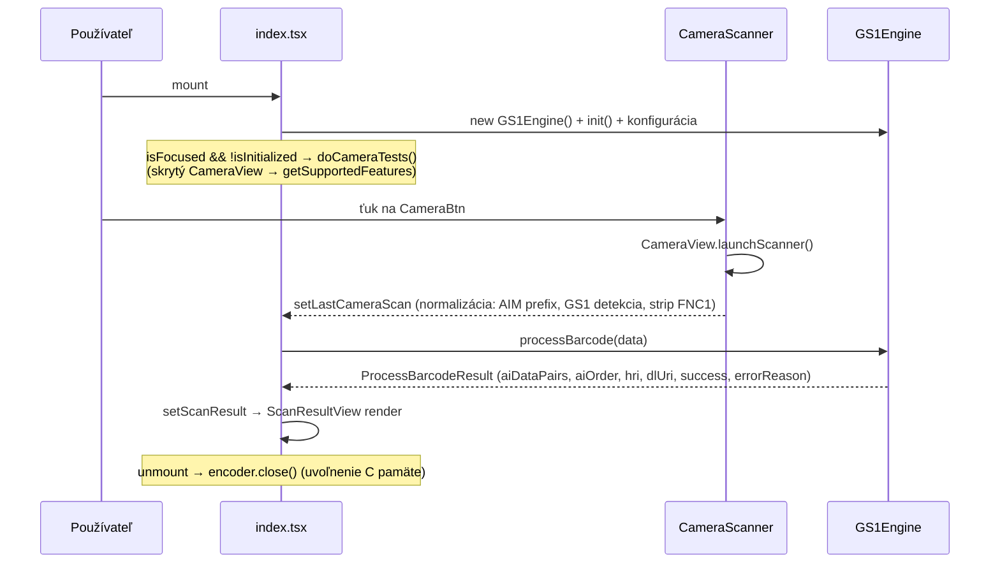

# SPECS – aktuálny kontext projektu

> **Stav k:** 07.10.2026 (verzia aplikácie `1.0.0`)
> **Zdroj pravdy:** táto + dokumentácia v [`docs/`](docs/README.md)
> **Účel súboru:** rýchly kontext pre vývojárov a AI agentov pred zásahom do kódu.

---

## 1. Identita projektu

| Položka | Hodnota |
|---|---|
| Názov | **expo-gs1-s-e-example** |
| Popis | Ukážková appka pre knižnicu `expo-gs1-syntax-engine` (GS1 Barcode Syntax Engine) |
| Verzia | `1.0.0` |
| Licencia | MIT (`LICENSE`) |
| Autor | Viliam \<info@gs1sk.org\> / GS1SlovakiaOrg |
| Repo | <https://github.com/GS1SlovakiaOrg/expo-gs1-s-e-example> |
| Android package | `com.expogs1sk.expogs1seexample` |
| URL schéma | `expogs1seexample` |
| Orientácia | portrait (zafixovaná) |
| Primárna platforma | **Android** (iOS nie je vygenerovaný – chýba `ios/`) |

## 2. Stack (aktuálne verzie z `package.json`)

| Kategória | Balík | Verzia |
|---|---|---|
| Framework | `expo` | `^57.0.16` (SDK 57) |
| Runtime | `react` / `react-native` | `19.2.3` / `0.86.2` |
| Routing | `expo-router` | `~57.0.16` (file-based, `typedRoutes` + `reactCompiler` zapnuté) |
| Kamera/skener | `expo-camera` | `~57.0.4` (`CameraView.launchScanner` → Google Code Scanner) |
| **GS1 engine** | `expo-gs1-syntax-engine` | `^0.1.8` (C engine 1.4.1) |
| Navigačná lišta | `expo-navigation-bar` | `~57.0.2` |
| Ikony | `@react-native-vector-icons/ant-design` | `^13.1.2` |
| Jazyk | `typescript` | `~6.0.3`, `strict: true` |
| Build | EAS CLI | `>= 21.0.2` (`eas.json`) |

**Kľúčové fakty:**
- `main: "expo-router/entry"` → routing je súborový v `src/app/`.
- Alias `@/*` → `./src/*`, `@/assets/*` → `./assets/*` (`tsconfig.json`).
- Aplikácia obsahuje **natívny modul** → v Expo Go **nebeží**, treba `npx expo prebuild` + dev build.
- `android/` je **generované** (`npx expo prebuild`) – neručne upravovať; zmeny cez config pluginy v `app.json`.
- `expo.modules.updates.ENABLED = false` → žiadne OTA aktualizácie.

## 3. Štruktúra (len relevantné)

```text
.
├── app.json, eas.json, package.json, tsconfig.json
├── android/                  # vygenerované (CNG)
├── docs/                     # kompletná dokumentácia (01–08 + README)
├── assets/images|expo.icon|readmeImages/scanExample.jpg
├── README.md, ToDo.md (prázdny), changelog.md, AGENTS.md, CLAUDE.md
└── src/
    ├── app/
    │   ├── _layout.tsx       # Stack, header = GS1 oranžová, titulok "Example App"
    │   └── index.tsx         # JEDINÁ obrazovka: stav, init engine, tok skenu
    ├── components/
    │   ├── views/cameraScannerView.tsx    # stavový switch spodnej časti
    │   ├── views/scanResultView.tsx       # render výsledku/chyby (+GS1AiDataView, BlueText, TwoColorText)
    │   ├── cameraScanner/cameraScanner.tsx# listener skenu + launchScanner (+getBarcodeTypeData)
    │   ├── buttons/buttons.tsx            # RoundIconButton, CameraBtn
    │   └── activityIndicator/activityIndicatorCentered.tsx
    ├── scripts/helpers.ts    # getDateTimeMilisecs(), calculateCheckDigit() (nevyužité)
    ├── styles/Colors.tsx     # GS1 paleta (modrá rgb(0,44,108), oranžová rgb(242,99,52))
    ├── styles/styles.tsx     # utility triedy (Bootstrap-like mierky 1–5 = 6/12/18/28/40 px)
    └── types/types.tsx       # cameraScanResult, barcodeScanResult, dateString
```

## 4. Ako to funguje (životný cyklus)



**3 hooky v `index.tsx`:**
1. `[]` – init engine + cleanup `close()` (povinný!).
2. `[isFocused, isInitialized]` – `doCameraTests()` (raz).
3. `[lastCameraScan]` – deduplikácia cez `timestamp` → `processScannedData()`.

**Konfigurácia engine:** `permitUnknownAIs=true`, `setValidationEnabled(RequisiteAIs,true)`,
`includeDataTitlesInHRI=true`, `permitZeroSuppressedGTINinDLuris=false`.

**Stavy spodnej časti (`CameraScannerView`, prvé pravidlo vyhráva); prop `isInitialized`
prichádza ako `isInitialized && isEncoderInit`:**
`!isInitialized` → loading · `isProcessingData` → "Processing scan data" ·
`!isCameraSupported` → text · `!isCameraEnabled` → text · inak `CameraScanner`
(v ňom: `hasCameraPerms ? CameraBtn : "Camera permissions not granted").

**Mapa typov (AIM):** `1→]C0 Code 128`, `2→]A0 Code 39`, `8→]F0 Codabar`, `16→]d0/]d2 Data Matrix (est.)`,
`32→]E0 EAN-13`, `64→]E4 EAN-8`, `128→]I0 ITF`, `256→]Q1/]Q3 QR (est.)`, `512/1024→]E0 UPC`,
`2048→]L1 PDF-417`, `4096→]z0 Aztec`, `C1→]C1 GS1-128`, inak `unknown`.

## 5. Dátové kontrakty

```ts
// src/types/types.tsx
type cameraScanResult = { data: string; decoder: string; timeAtDecode: string; timestamp: number };
interface barcodeScanResult extends ProcessBarcodeResult {
  data: string; decoder: string; timeAtDecode: string; timestamp: number;
}

// expo-gs1-syntax-engine
type ProcessBarcodeResult = {
  success: boolean; error?, errorReason?, errorMarkup?, dataStr?, aiDataStr?,
  hri?: string[], dlUri?, aiDataPairs?: Record<string,{name,value}>, aiOrder?: string[],
  symbology?, symbologyName?, scanData?, aimPrefix?
};
```

Výstup `processBarcode()` sa merge-uje: `{...decodingResult, ...scan}` → `scanResult`.

## 6. Konfigurácia a príkazy

```bash
npm install            # závislosti
npx expo prebuild      # generuje android/
npx expo run:android   # build + spustenie
npm start | run:ios | run:web | run:lint
eas build --platform android --profile preview|production
```

| EAS profil | distribúcia | android buildType | autoIncrement |
|---|---|---|---|
| `development` | internal (devClient) | apk | – |
| `preview` | internal | apk | – |
| `production` | store | – | true |

Pluginy v `app.json`: `expo-router`, `expo-splash-screen` (`#208AEF`, `splash-icon.png`, 76 px),
`expo-navigation-bar` (`style: dark`, `enforceContrast`), `expo-image`, `expo-web-browser`.
Oprávnenia (Manifest): `CAMERA`, `INTERNET`, `RECORD_AUDIO`, `VIBRATE`, `SYSTEM_ALERT_WINDOW`,
`READ/WRITE_EXTERNAL_STORAGE` (≤32).

## 7. Aktuálny stav / známe problémy (detail: [`docs/08-…`](docs/08-obmedzenia-a-znama-problemy.md))

**Vyriešené commitom `a05b16f` (07.10.2026):**
- ~~**P1** `requestPermission()` počas renderu~~ → je vo `useEffect` (`[permission, hasCameraPerms]`).
- ~~**P5** vetva `if (!encoder) return` nevynuluje `isProcessingData`~~ → vynuluje; **stále chýba
  `try/finally`** okolo `processBarcode()` (P5 = čiastočne).
- ~~**P7** `barcodeScanResult` v `index.tsx` (kruh)~~ → presunuté do `src/types/types.tsx`.
- ~~**P8** preklep `isloading`~~ → premenované na `isEncoderInit` (`true` = init skončený);
  premenná `encoder` však stále drží dekódovací engine (P8 = čiastočne).
- ~~**P9** `ViewFixedText()` ako funkcia~~ → komponent s props `{ viewText }`.

**Otvorené:**
- **P2** `CameraView.dismissScanner()` je iOS-only; na Android je nadbytočné + nie je ošetrené
  výnimky vnútri callbacku.
- **P3** `event.raw` nie je dokumentované v type `ScanningResult` (SDK 57) – GS1 detekcia na ňom závisí.
- **P4** chyba pri registrácii listenera nastaví `timestamp: 0` → sken sa ticho nespracuje.
- **P5** (zvyšok) chýba `try/finally` okolo `processBarcode()`.
- **P8** (zvyšok) premenná `encoder` drží dekódovací engine.
- **P10** `helpers.calculateCheckDigit()` = nevyužitý duplikát metódy knižnice.
- **P11** `getDateTimeMilisecs()` nepoužíva padding (nejednotný formát času).
- **P15** README nezmieňuje oprávnenia ani požiadavku GMS (Google Code Scanner).
- **P16** `Text` sa importuje z interného `expo-router/build/react-navigation` namiesto `react-native`.
- **P17** permission `useEffect` číta starú hodnotu `hasCameraPerms` → hrozí opakované volanie
  `requestPermission()`.
- Bez testov, bez CI, bez i18n, bez dark mode (štýly fixné), posledný výsledok sa nikde nemaže.

**Nevyužitý potenciál engine (už dostupné):** `hri`, `dlUri`, `dataStr`/`aiDataStr`, `symbologyName`,
`errorMarkup`, `aimPrefix` – aplikácia zatiaľ zobrazuje len `aiDataPairs` + metadeta skenu.

## 8. Platné pravidlá pre zmeny kódu

1. **Čítať versioned docs:** <https://docs.expo.dev/versions/v57.0.0/> (podľa `AGENTS.md`).
2. Neručne upravovať `android/` → iba `app.json` + `npx expo prebuild --clean`.
3. Farby cez `src/styles/Colors.tsx` (žiadne hex literály v komponentoch), štýly cez `styles.tsx`.
4. Pri `GS1Engine` **vždy** mať v `useEffect` cleanup `close()` (únik C pamäte).
5. Nové typy pridávať do `src/types/types.tsx` (drží typy spolu – kruhový import P7 je tým vyriešený).
6. Texty UI sú pevné anglické (žiadny i18n framework).
7. Kód v `strict` TypeScripte, importy cez alias `@/…`.

## 9. Dokumentácia

| Súbor | Téma |
|---|---|
| [`docs/README.md`](docs/README.md) | index dokumentácie |
| [`docs/01-uvod.md`](docs/01-uvod.md) | účel, rozsah, pojmy, stack |
| [`docs/02-architektura.md`](docs/02-architektura.md) | štruktúra, routing, závislosti, typy |
| [`docs/03-datovy-tok-a-zivotny-cyklus.md`](docs/03-datovy-tok-a-zivotny-cyklus.md) | hooky, stavy, sekvencie, normalizácia skenu |
| [`docs/04-komponenty-a-stav.md`](docs/04-komponenty-a-stav.md) | referencie komponentov a props |
| [`docs/05-gs1-syntax-engine.md`](docs/05-gs1-syntax-engine.md) | API engine, formáty vstupu/výstupu |
| [`docs/06-konfiguracia-a-build.md`](docs/06-konfiguracia-a-build.md) | app.json, EAS, oprávnenia, build |
| [`docs/07-dizajn-a-styly.md`](docs/07-dizajn-a-styly.md) | farby, typografia, utility triedy |
| [`docs/08-obmedzenia-a-znama-problemy.md`](docs/08-obmedzenia-a-znama-problemy.md) | known issues + backlog |

Súvisiace súbory v koreni: `README.md` (oficiálny), `changelog.md`, `ToDo.md` (prázdny),
`AGENTS.md` / `CLAUDE.md` (inštrukcie pre agentov).
