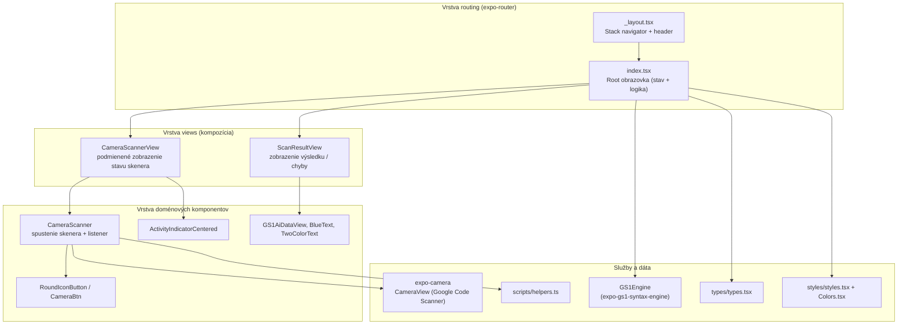
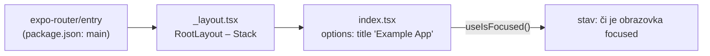
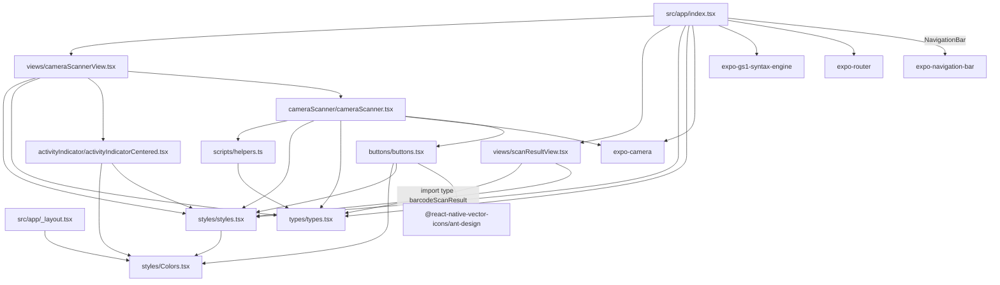
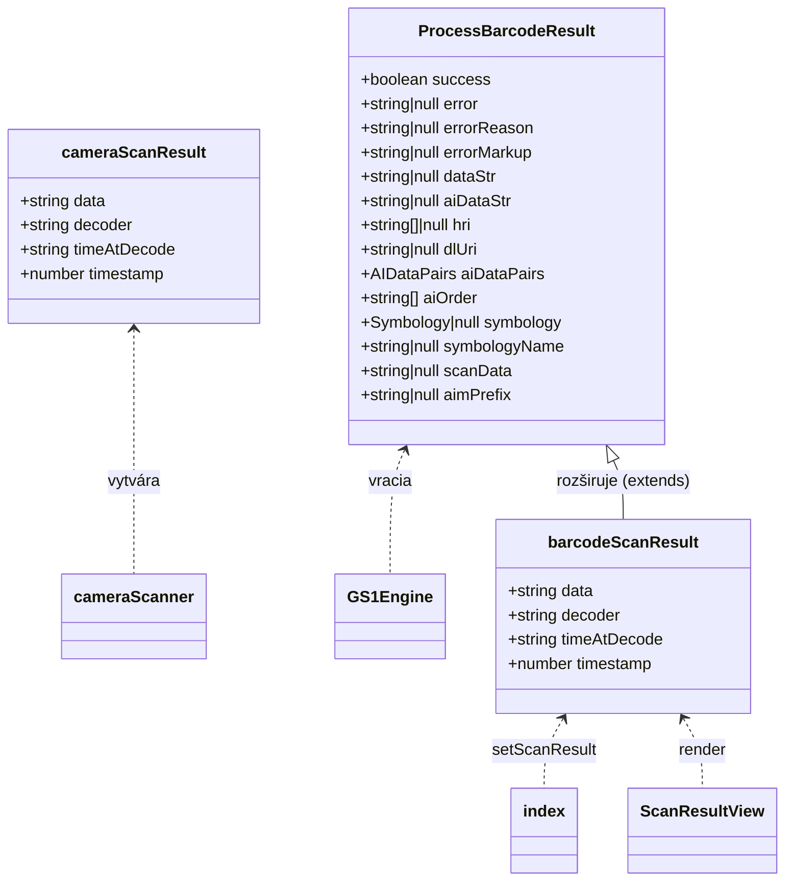
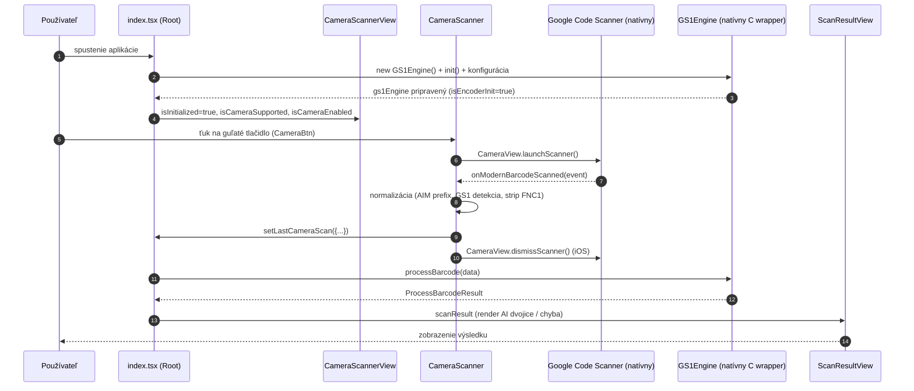

# 2. Architektúra

## 2.1 Prehľad vrstiev

Aplikácia je jednoobrazovková a nasleduje priamu (lineárnu) architektúru bez stavového manažmentu
knižnice (bez Redux/Zustand/Context). Stav žije výhradne vo `useState`/`useRef` v koreňovej
obrazovke `src/app/index.tsx` a smerom „dole“ sa odovzdáva cez props.



## 2.2 Štruktúra repozitára

```text
expo-gs1-s-e-example/
├── AGENTS.md                  # inštrukcie pre AI agentov (čítať docs.expo.dev/versions/v57.0.0)
├── CLAUDE.md                  # len odkaz "@AGENTS.md"
├── README.md                  # oficiálny readme projektu
├── ToDo.md                    # zoznam úloh (zatiaľ len nadpis "# ToDo")
├── changelog.md               # zmeny (v1.0.0 initial commit; vxxx – pracovná sekcia)
├── LICENSE                    # MIT
├── app.json                   # konfigurácia Expo aplikácie
├── eas.json                   # konfigurácia EAS Build / Submit
├── package.json               # závislosti a skripty
├── package-lock.json
├── tsconfig.json              # strict TS + aliasy @/*, @/assets/*
├── expo-env.d.ts
├── android/                   # VYGENEROVANÉ cez `npx expo prebuild` (CNG)
│   ├── app/                   #   manifest, zdroje, Gradle projekt
│   ├── build.gradle, settings.gradle, gradle.properties, gradlew*
├── assets/
│   ├── images/                # icon.png, splash-icon.png, favicon.png, android-icon-*.png, ...
│   ├── expo.icon/             # iOS ikona (icon.json, Assets/)
│   └── readmeImages/
│       └── scanExample.jpg    # screenshot použitý v README
├── docs/                      # táto dokumentácia
└── src/
    ├── app/                   # expo-router: file-based routing
    │   ├── _layout.tsx        # koreňový Stack (header – GS1 oranžová, biely text)
    │   └── index.tsx          # Jediná obrazovka: stav, init engine, tok skenu
    ├── components/
    │   ├── activityIndicator/
    │   │   └── activityIndicatorCentered.tsx
    │   ├── buttons/
    │   │   └── buttons.tsx            # RoundIconButton, CameraBtn
    │   ├── cameraScanner/
    │   │   └── cameraScanner.tsx      # listener skenu + spustenie systémového skenera
    │   └── views/
    │       ├── cameraScannerView.tsx  # stavový „switch“ pre spodnú časť obrazovky
    │       └── scanResultView.tsx     # zobrazenie výsledku dekódovania
    ├── scripts/
    │   └── helpers.ts                 # getDateTimeMilisecs(), calculateCheckDigit()
    ├── styles/
    │   ├── Colors.tsx                 # farebná paleta (GS1 brand)
    │   └── styles.tsx                 # StyleSheet s utility triedami
    └── types/
        └── types.tsx                  # cameraScanResult, barcodeScanResult, dateString
```

### Poznámky k štruktúre

- **Routing je v `src/app/`** – Expo Router (`main: "expo-router/entry"`) mapuje súbory tohto
  priečinka na trasy. Sú tam presne 2 súbory → 1 obrazovka.
- Priečinky `components/`, `styles/`, `scripts/`, `types/` **nie sú súčasťou routing** – sú to
  obyčajné moduly.
- Alias `@/*` (v `tsconfig.json`) smeruje na `./src/*`, takže importy vyzerajú ako
  `@/styles/styles`, `@/components/views/cameraScannerView`, …
- `android/` je artefakt `expo prebuild` – **nemá sa upravovať ručne** (CNG – Continuous Native
  Generation). Zmeny sa majú robiť cez config pluginy v `app.json`.

## 2.3 Routing a navigácia



- `_layout.tsx` nastavuje `screenOptions`: `headerStyle.backgroundColor = gs1OrangeColorRgb`,
  `headerTintColor = '#fff'`, `headerTitleAlign = 'center'`.
- `Stack.Screen name="index"` má titulok **Example App**.
- `useIsFocused()` z `expo-router` sa používa na to, aby sa test kamery spustil až keď je
  obrazovka viditeľná.
- `app.json` → `experiments.typedRoutes: true` zapína generovanie typovaných trás.

## 2.4 Závislosti medzi modulmi (import graph)



> `scanResultView.tsx` aj `index.tsx` importujú typ `barcodeScanResult` zo `src/types/types.tsx`
> – kruhová závislosť, ktorá tu pôvodne bola (index → scanResultView → index), bola odstránená
> presunutím typu do spoločného modulu (pozri
> [08-obmedzenia-a-znama-problemy.md](08-obmedzenia-a-znama-problemy.md)).

## 2.5 Kontrakt medzi vrstvami (typy)



Zdroje typov:

| Typ | Súbor | Pôvod |
|---|---|---|
| `cameraScanResult` | `src/types/types.tsx` | projekt |
| `dateString` | `src/types/types.tsx` | projekt |
| `barcodeScanResult` | `src/types/types.tsx` | projekt (extends `ProcessBarcodeResult`) |
| `ProcessBarcodeResult`, `AIDataPairs`, `Symbology`, `Validation`, `InitOptions` | `expo-gs1-syntax-engine` | knižnica |
| `ScanningResult` (`data`, `type`, príp. `raw`) | `expo-camera` | knižnica |

## 2.6 Beh aplikácie – prehľad



Podrobnosti v [03-datovy-tok-a-zivotny-cyklus.md](03-datovy-tok-a-zivotny-cyklus.md).

## 2.7 Rozhodnutia o návrhu

| Rozhodnutie | Dôvod |
|---|---|
| Jediný screen bez globálneho stavu | demo aplikácia, minímálna komplexnosť |
| Engine sa inicializuje v `useEffect([], …)` s cleanup `close()` | natívny kontext (C pamäť) sa musí uvoľniť pri unmount |
| Skener sa nespúšťa priamo v UI, ale cez **systémový** Google Code Scanner | žiadny vlastný camera preview, žiadne front-end spracovanie snímok |
| Skrytý `CameraView` (`display: 'none'`) | slúži len na zistenie `getSupportedFeatures()` – či zariadenie podporuje moderný skener |
| Detekcia GS1 „odhadom“ (est.) | Google Code Scanner neoznačuje GS1 varianty explicitne → aplikácia odvodzuje GS1 podľa prítomnosti znaku ASCII 29 |
| Utility štýly namiesto Tailwind/NativeWind | žiadna ďalšia závislosť, konzistentný GS1 look |
