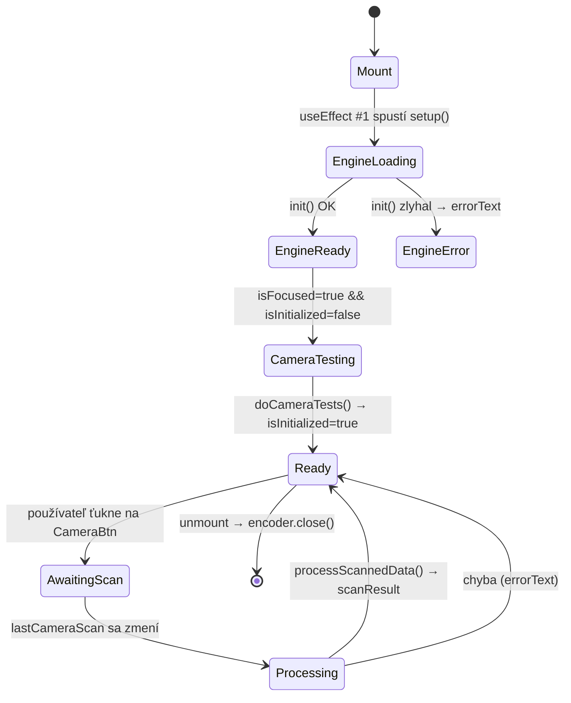
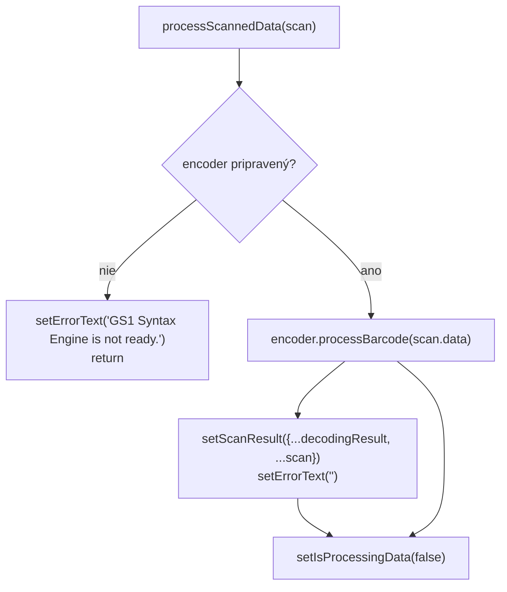
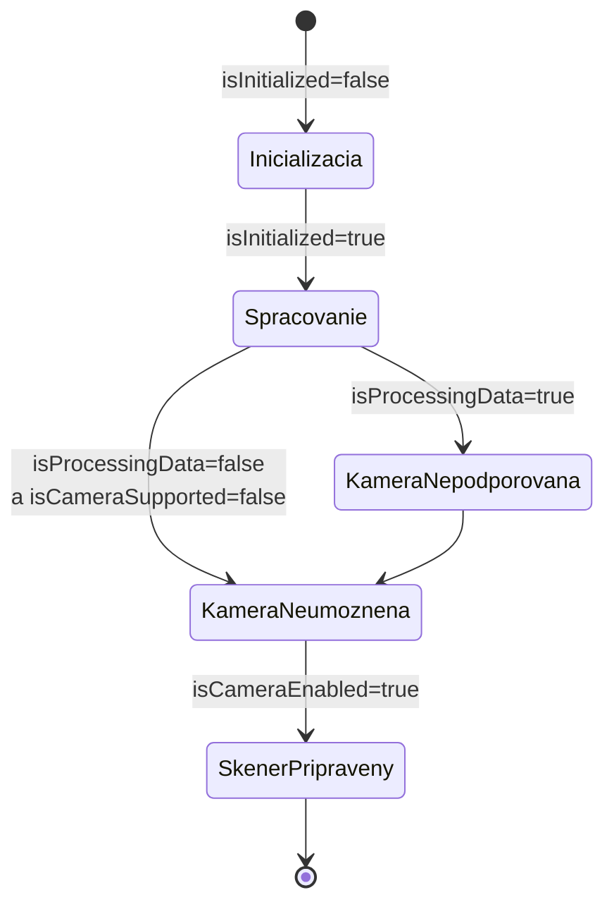
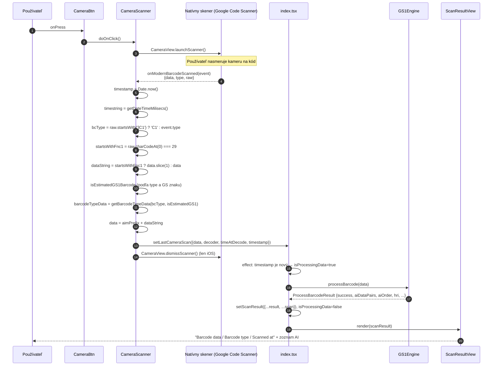
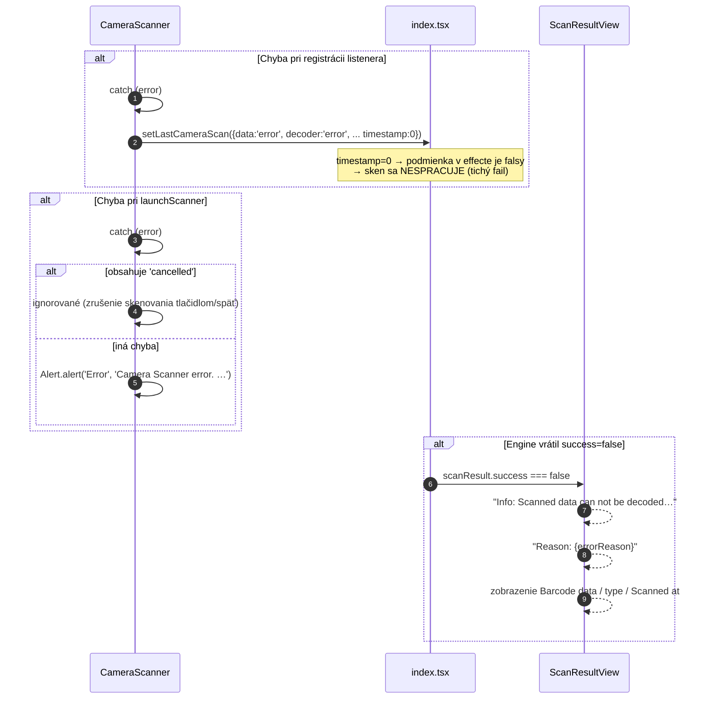
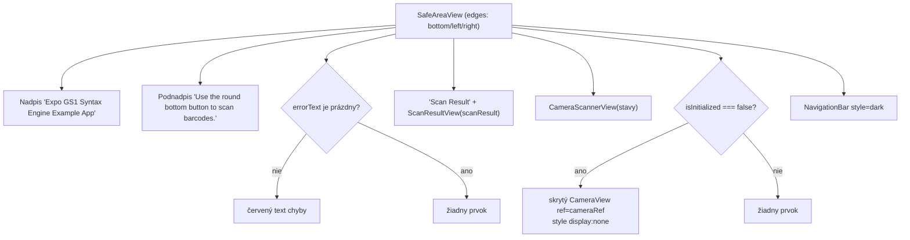
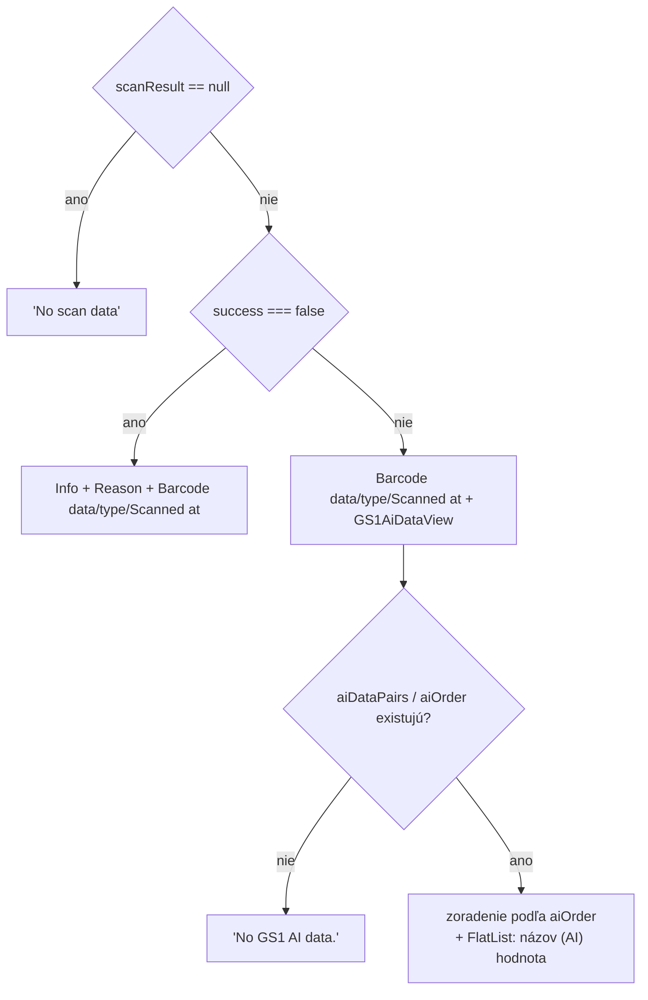
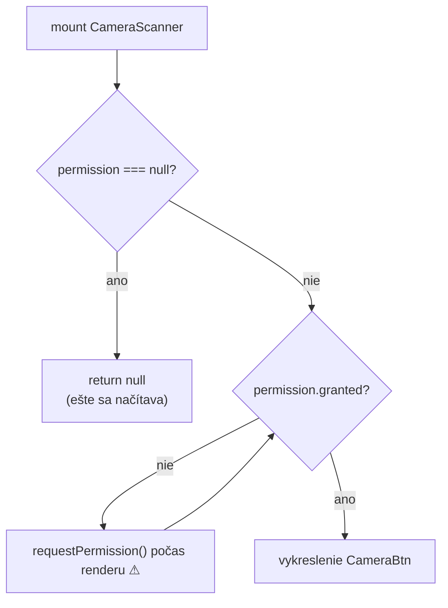

# 3. Dátový tok a životný cyklus

## 3.1 Stavové premenné (`src/app/index.tsx`)

| Premenná | Typ | Význam | Nastavuje sa |
|---|---|---|---|
| `cameraRef` | `useRef<CameraView>` | ref na **skrytý** `CameraView` – slúži len na `getSupportedFeatures()` | mount/unmount |
| `isFocused` | `boolean` (z `useIsFocused()`) | či je obrazovka aktuálna | expo-router |
| `isInitialized` | `boolean` | či bol vykonaný test kamery (`doCameraTests`) | `doCameraTests()` |
| `isCameraSupported` | `boolean` | či zariadenie má vôbec kameru (`features !== undefined`) | `doCameraTests()` |
| `isCameraEnabled` | `boolean` | či je dostupný **moderný barcode skener** | `doCameraTests()` |
| `isProcessingData` | `boolean` | práve prebieha dekódovanie skenu | effect na `lastCameraScan` |
| `lastCameraScanTime` | `number` | timestamp posledne spracovaného skenu (**deduplikácia**) | effect na `lastCameraScan` |
| `lastCameraScan` | `cameraScanResult` | surový výstup zo skenera | `setLastCameraScan` z `CameraScanner` |
| `scanResult` | `barcodeScanResult \| null` | výsledok `processBarcode` + metadeta skenu (to, čo sa renderuje) | `processScannedData()` |
| `encoder` | `GS1Engine \| null` | inicializovaná inštancia engine | effect init |
| `isloading` | `boolean` | prebieha init engine (v kóde zámerne/preklepo `isloading`) | effect init |
| `errorText` | `string` | chybová hláška zobrazená pod nadpisom | effect init / `processScannedData()` |

Lokálne stavy v podkomponentoch:

| Komponent | Stav | Význam |
|---|---|---|
| `CameraScanner` | `permission`, `requestPermission` (`useCameraPermissions`) | oprávnenie kamery |

## 3.2 Životný cyklus – `useEffect` hooky v `index.tsx`



### Hook #1 – inicializácia engine (`[]`)

```tsx
useEffect(() => {
  let activeEncoder: GS1Engine | null = null;
  async function setup() {
    try {
      setIsLoading(true);
      activeEncoder = await initGS1Encoder();   // new GS1Engine() + init() + nastavenia
      setEncoder(activeEncoder);
      setErrorText('');
    } catch (err: any) {
      setErrorText(`Error initializing the C engine: ${err.message}`);
    } finally {
      setIsLoading(false);
    }
  }
  setup();
  return () => { if (activeEncoder) activeEncoder.close(); };  // uvoľnenie C pamäte
}, []);
```

- Spustí sa raz pri mounte.
- **Cleanup je povinný** – `close()` uvoľní natívny kontext; bez neho uniká C pamäť.
- Pri chybe sa `errorText` zobrazí na obrazovke a `isloading` končí v `false`
  (aj keď engine nie je pripravený → pri ďalšom skene sa zobrazí
  „GS1 Syntax Engine is not ready.“).

### Hook #2 – test kamery (`[isFocused, isInitialized]`)

```tsx
useEffect(() => {
  if (isFocused === true && isInitialized === false) doCameraTests();
}, [isFocused, isInitialized]);
```

`doCameraTests()`:

1. `cameraRef.current?.getSupportedFeatures()` – ak je `undefined`, zariadenie nemá kameru
   → `isCameraSupported = false`.
2. Inak `isCameraSupported = true` a podľa `features.isModernBarcodeScannerAvailable`
   sa nastaví `isCameraEnabled`.
3. Na konci `setIsInitialized(true)` – zabráni opakovanému behu.

> Skrytý `CameraView` sa renderuje len kým `isInitialized === false`; potom sa odmontuje a
> `cameraRef` je prázdny. Test sa teda vykonáva len raz.

### Hook #3 – spracovanie nového skenu (`[lastCameraScan]`)

```tsx
useEffect(() => {
  if (lastCameraScan.timestamp && lastCameraScanTime !== lastCameraScan.timestamp) {
    setIsProcessingData(true);
    setLastCameraScanTime(lastCameraScan.timestamp);
    processScannedData(lastCameraScan);
  }
}, [lastCameraScan]);
```

- **Deduplikácia cez timestamp** – zabráni spracovaniu tej istej udalosti viackrát
  (napr. re-render).
- Ak by dva skeny mali identický `Date.now()` (teoreticky možné v rýchlom slede),
  druhý by sa nespracoval; v praxi je to zanedbateľné.

### `processScannedData()`



Výsledok je **spojenie** výsledku engine a metadát skenu:

```ts
scanResult = {
  ...decodingResult,   // success, errorReason, hri, aiDataPairs, aiOrder, dlUri, ...
  ...scannData         // data, decoder, timeAtDecode, timestamp
}
```

## 3.3 Stavový automat spodnej časti obrazovky (`CameraScannerView`)

Komponent vykonáva lineárnu kontrolu podmienok (prvá splnená vyhráva):



| Podmienka | Render | Text |
|---|---|---|
| `isInitialized === false` | `ActivityIndicatorCentered` | *Loading / The availability of device camera is being verified.* |
| `isProcessingData === true` | `ActivityIndicatorCentered` | *Processing scan data* |
| `isCameraSupported === false` | text | *Camera is not supported.* |
| `isCameraEnabled === false` | text | *Camera is not enabled. Enable camera and reopen app.* |
| inak | `CameraScanner` | guľaté tlačidlo skenera |

## 3.4 Sekvenčný diagram – úspešný sken



## 3.5 Sekvenčný diagram – chybové vetvy



## 3.6 Normalizácia skenu (podrobne v `cameraScanner.tsx`)

Vstupný objekt udalosti: `ScanningResult` = `{ data: string, type: string, raw?: string }`.

Postup krokov:

| # | Výpočet | Význam |
|---|---|---|
| 1 | `timestamp = Date.now()` | kľúč pre deduplikáciu |
| 2 | `timestring = getDateTimeMilisecs()` | čitateľný čas `DD.MM.YYYY HH:MM:SS:mmm` |
| 3 | `bcType = event.raw?.startsWith(']C1') ? 'C1' : event.type` | ak je v raw uvedený AIM `]C1` → ide o GS1-128 |
| 4 | `startsWithFnc1 = event.raw?.charCodeAt(0) === 29` | úvodný GS (FNC1) znak → typické pre GS1 kódy |
| 5 | `dataString = startsWithFnc1 ? event.data.slice(1) : event.data` | odstránenie úvodného GS znaku z dát |
| 6 | `includesGS = event.raw?.includes(String.fromCharCode(29))` | GS znak kdekoľvek v raw údajoch |
| 7 | `isEstimatedGS1Barcode` | pre typ `256` (QR): `includesGS`; inak: `startsWithFnc1` |
| 8 | `barcodeTypeData = getBarcodeTypeData(bcType, isEstimatedGS1)` | názov symbologie + AIM prefix |
| 9 | `data = aimPrefix + dataString` | finálny vstup pre engine |

### Mapa typov kódov → názov + AIM prefix

Tabuľka `getBarcodeTypeData()` – kľúč je číselný formát kódu (Google ML Kit / Android `Barcode.FORMAT_*`):

| Kľúč (type) | Názov (decoder) | AIM prefix | Poznámka |
|---|---|---|---|
| `0` | unknown | `null` | neznámy formát |
| `1` | Code 128 | `]C0` | |
| `2` | Code 39 | `]A0` | |
| `4` | Code 93 | `]G0` | |
| `8` | Codabar | `]F0` | |
| `16` | Data Matrix / **GS1 Data Matrix (est.)** | `]d0` / `]d2` | GS1 variant len ak `isEstimatedGS1Barcode` |
| `32` | EAN-13 | `]E0` | |
| `64` | EAN-8 | `]E4` | |
| `128` | ITF | `]I0` | |
| `256` | QR Code / **GS1 QR Code (est.)** | `]Q1` / `]Q3` | GS1 variant len ak `isEstimatedGS1Barcode` |
| `512` | UPC-A | `]E0` | |
| `1024` | UPC-E | `]E0` | |
| `2048` | PDF-417 | `]L1` | |
| `4096` | AZTEC | `]z0` | |
| `C1` | **GS1 128** | `]C1` | zvláštny kľúč – odvodený z raw reťazca |
| `-1` | unknown | `null` | neznámy formát |

Ak kľúč nie je v tabuľke, vracia sa záznam `"0"` (unknown).

### Príklad výsledného reťazca

```text
vstup event.data : 010858000000000910Lot858\u001D21Serial01   (raw začína GS znakom)
po úprave        : ]d2 + 010858000000000910Lot858\u001D21Serial01
decoder          : GS1 Data Matrix (est.)
```

## 3.7 Závislosti renderingu od stavu (hlavná obrazovka)



`ScanResultView` vykresľuje tri podoby:



## 3.8 Riadenie oprávnení (permissions)



Poznámka: `requestPermission()` sa volá **priamo počas renderu** (nie v `useEffect`), čo môže
spôsobiť opakované re-render volania – pozri
[08-obmedzenia-a-znama-problemy.md](08-obmedzenia-a-znama-problemy.md).
