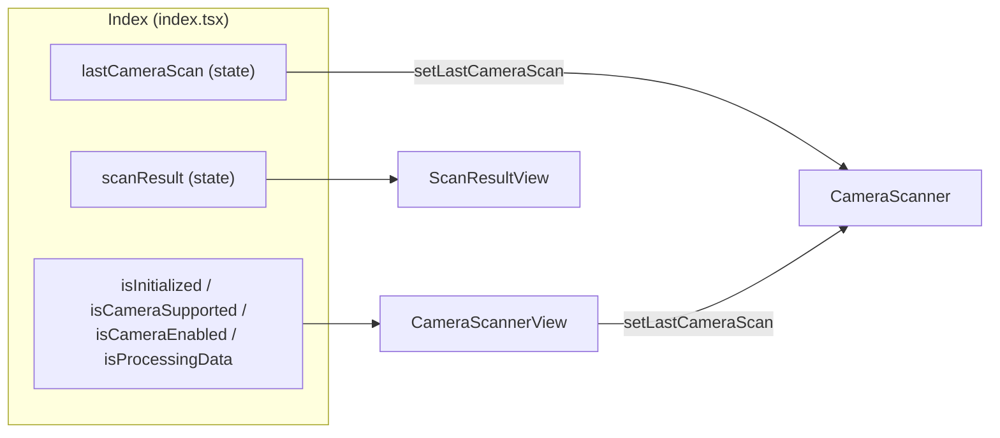

# 4. Referencia komponentov a stavu

## 4.1 Prehľad komponentov

| Súbor | Export | Úloha |
|---|---|---|
| `src/app/_layout.tsx` | `RootLayout` (default) | Koreňový `Stack` navigator + štýl hlavičky |
| `src/app/index.tsx` | `Index` (default) | Hlavná (a jediná) obrazovka: stav, init engine, tok skenu |
| `src/components/views/cameraScannerView.tsx` | `CameraScannerView` (default) | Podmienené zobrazenie spodnej časti (loading / chyba / skener) |
| `src/components/views/scanResultView.tsx` | `ScanResultView` (+ interné `GS1AiDataView`, `BlueText`, `TwoColorText`) | Zobrazenie výsledku dekódovania alebo chyby |
| `src/components/cameraScanner/cameraScanner.tsx` | `CameraScanner` (+ interné `getBarcodeTypeData`) | Listener skenu, spustenie systémového skenera, mapovanie typov |
| `src/components/buttons/buttons.tsx` | `RoundIconButton`, `CameraBtn` | Guľaté iconové tlačidlo (scan) |
| `src/components/activityIndicator/activityIndicatorCentered.tsx` | `ActivityIndicatorCentered` | Centrovaný spinner s nadpisom a textom |
| `src/scripts/helpers.ts` | `getDateTimeMilisecs`, `calculateCheckDigit` | Pomocné funkcie |
| `src/styles/Colors.tsx` | `Colors` (default) | Farebná paleta |
| `src/styles/styles.tsx` | `styles` | `StyleSheet` s utility triedami |
| `src/types/types.tsx` | `cameraScanResult`, `barcodeScanResult`, `dateString` | Zdieľané typy |

---

## 4.2 `RootLayout` – `src/app/_layout.tsx`

```tsx
<Stack screenOptions={{ headerStyle:{backgroundColor: Colors.gs1OrangeColorRgb},
                        headerTintColor:'#fff', headerTitleAlign:'center' }}>
  <Stack.Screen name="index" options={{title:'Example App'}} />
</Stack>
```

| Prop / voľba | Hodnota | Popis |
|---|---|---|
| `headerStyle.backgroundColor` | `rgb(242, 99, 52)` (GS1 oranžová) | farba hlavičky |
| `headerTintColor` | `#fff` | farba textu/šípky v hlavičke |
| `headerTitleAlign` | `center` | titulok na stred |
| `Stack.Screen options.title` | `Example App` | titulok obrazovky |

---

## 4.3 `Index` – `src/app/index.tsx`

Koreňová obrazovka. Vlastní celý stav a životný cyklus (podrobnosti v
[03-datovy-tok-a-zivotny-cyklus.md](03-datovy-tok-a-zivotny-cyklus.md)).

### Verejné rozhrania

`index.tsx` už typ `barcodeScanResult` **neexportuje** – definícia presunutá do
`src/types/types.tsx` (pozri sekciu [4.10 Zdieľané typy](#410-zdieľané-typy--srctypstypesx),
nižšie); importuje sa odtiaľ cez `@/types/types`:

```ts
export interface barcodeScanResult extends ProcessBarcodeResult {
  data: string;        // normalizovaný reťazec zo skenera (AIM prefix + dáta)
  decoder: string;     // názov symbologie (napr. "GS1 Data Matrix (est.)")
  timeAtDecode: string;// "DD.MM.YYYY HH:MM:SS:mmm"
  timestamp: number;   // Date.now()
}
```

### `initGS1Engine(): Promise<GS1Engine>`

```ts
const gs1Engine = new GS1Engine();
await gs1Engine.init();
gs1Engine.permitUnknownAIs = true;
gs1Engine.setValidationEnabled(GS1Engine.validation.RequisiteAIs, true);
gs1Engine.includeDataTitlesInHRI = true;
gs1Engine.permitZeroSuppressedGTINinDLuris = false;
```

| Nastavenie | Hodnota | Význam |
|---|---|---|
| `permitUnknownAIs` | `true` | povoľuje AI, ktoré nie sú v statickej tabuľke knižnice |
| `setValidationEnabled(Validation.RequisiteAIs, true)` | zapnuté | kontrola, či sú povinné AI prítomné |
| `includeDataTitlesInHRI` | `true` | HRI obsahuje aj názvy polí (napr. „GTIN“) |
| `permitZeroSuppressedGTINinDLuris` | `false` | v DL URI sa vyžaduje plný GTIN-14 (zero-suppressed GTIN sú deprecované) |

### Render strom

```text
SafeAreaView (edges: bottom, left, right) – styles.containerBase
└─ View (styles.containerBase)
   ├─ Text h3  "Expo GS1 Syntax Engine Example App"
   ├─ Text     "Use the round bottom button to scan barcodes." (GS1 modrá)
   ├─ Text     errorText (ak nie je prázdne, červená)
   ├─ View px2
   │  ├─ Text h4 "Scan Result"
   │  └─ ScanResultView { scanResult }
   ├─ CameraScannerView { isInitialized, isProcessingData, isCameraSupported,
   │                      isCameraEnabled, setLastCameraScan }
   └─ CameraView (len ak isInitialized===false; style display:'none',
                  mode:'picture', facing:'back', ref=cameraRef)
└─ NavigationBar style="dark"
```

---

## 4.4 `CameraScannerView` – `src/components/views/cameraScannerView.tsx`

### Props

| Prop | Typ | Smer | Popis |
|---|---|---|---|
| `isInitialized` | `boolean` | vstup | `isInitialized && isEncoderInit` – test kamery hotový **a** init engine skončený |
| `isProcessingData` | `boolean` | vstup | prebieha dekódovanie |
| `isCameraSupported` | `boolean` | vstup | zariadenie má kameru |
| `isCameraEnabled` | `boolean` | vstup | dostupný moderný barcode skener |
| `setLastCameraScan` | `Dispatch<SetStateAction<cameraScanResult>>` | vstup | callback pre odovzdanie skenu rodičovi |

### Správanie

Vykonať kontrolu v tomto poradí (podmienka → zobrazenie); pozri stavový automat v
[03.3](03-datovy-tok-a-zivotny-cyklus.md#33-stavový-automat-spodnej-časti-obrazovky-camerascannerview).
`ViewFixedText` je interný **komponent** s props `{ viewText: string }` (volá sa ako
`<ViewFixedText viewText="…" />`) a vracia `View` s textom; nie je exportovaný.

---

## 4.5 `ScanResultView` – `src/components/views/scanResultView.tsx`

### Props

| Prop | Typ | Popis |
|---|---|---|
| `scanResult` | `barcodeScanResult \| null` | výsledok posledného skenu |

### Vetvy zobrazenia

| Stav | Zobrazenie |
|---|---|
| `scanResult == null` | `No scan data` (na stred) |
| `success === false` | `Info:` + dôvod (`errorReason`), `Scanned data:`, `Barcode data`, `Barcode type`, `Scanned at` |
| `success === true` | `Barcode data`, `Barcode type`, `Scanned at` + zoznam AI |

### Interné komponenty

| Komponent | Props | Úloha |
|---|---|---|
| `GS1AiDataView` | `data: AIDataPairs \| undefined`, `order: string[] \| undefined` | zoradí dvojice podľa `aiOrder` a vykreslí `FlatList`; ak chýbajú údaje → `No GS1 AI data.` |
| `BlueText` | `heading`, `content` | modrý tučný nadpis + obsah |
| `TwoColorText` | `heading`, `content1`, `content2` | modrý nadpis + oranžový (AI v zátvorkách) + bežný text |

Príklad riadku: **Lot / Batch Number** `(10)` `Lot858`

Lokálne typy:

```ts
type AIDataItem  = { name: string; value: string };
type AIDataPairs = Record<string, AIDataItem>;   // { "10": { name: "Lot / Batch Number", value: "Lot858" } }
```

---

## 4.6 `CameraScanner` – `src/components/cameraScanner/cameraScanner.tsx`

### Props

| Prop | Typ | Popis |
|---|---|---|
| `setLastCameraScan` | `Dispatch<SetStateAction<cameraScanResult>>` | odovzdanie výsledku skenu rodičovi |

### Verejné správanie

| Akcia | Implementácia |
|---|---|
| ťuk na tlačidlo | `CameraView.launchScanner()` (Android → Google Code Scanner, iOS → systémový modal) |
| príchod skenu | `CameraView.onModernBarcodeScanned(listener)` – v `useEffect` s cleanup `subscription.remove()` |
| zrušenie skenera | chyba obsahujúca `cancelled` sa **ignoruje** |
| iná chyba spustenia | `Alert.alert('Error', 'Camera Scanner error. …')` |
| ukončenie skenera (iOS) | `CameraView.dismissScanner()` |
| oprávnenie | `useCameraPermissions()`; stav sa zrkadlí do `hasCameraPerms` vo `useEffect` – ak je `false`, volá sa `requestPermission()` |
| render spodnej časti | `hasCameraPerms` → `<CameraBtn/>`; inak text *Camera permissions not granted* (z `expo-router` `Text`, pozri P16) |

### `getBarcodeTypeData(barcodeType, isEstimatedGS1Barcode)`

Vracia `{ type: string, aimPrefix: string }`. Kompletná mapa kľúčov je v
[3.6](03-datovy-tok-a-zivotny-cyklus.md#36-normalizácia-skenu-podrobne-v-camerascannertsx).

---

## 4.7 `RoundIconButton` / `CameraBtn` – `src/components/buttons/buttons.tsx`

| Vlastnosť | `RoundIconButton` | `CameraBtn` |
|---|---|---|
| Props | `iconName`, `iconSize`, `doOnClick` | `doOnClick` |
| Ikona | `AntDesign[name]` | `scan`, veľkosť `30` |
| Štýl | `roundedBorderBtn` (border 2, radius 50), `px3 py3` | dedí |
| Stlačené | `btnPressed` (oranžové pozadie, biely border/ikona) | dedí |
| Nestlačené | `btnNotPressed` (biele pozadie, oranžový border/ikona) | dedí |
| Umiestnenie | `containerAbsoluteBR` + `backgroundWhite` + `containerRounded` (absolútne vpravo dole) | dedí |

## 4.8 `ActivityIndicatorCentered`

| Prop | Typ | Popis |
|---|---|---|
| `heading` | `string` | nadpis (štýl `h2`, GS1 modrá) |
| `text` | `string` | doplnkový text |

Zobrazuje `ActivityIndicator size="large"` v GS1 modrej, centrované na celom priestore
(`containerCenterAll`, `backgroundWhite`).

---

## 4.9 Pomocné funkcie – `src/scripts/helpers.ts`

| Funkcia | Signatúra | Popis | Použitie |
|---|---|---|---|
| `getDateTimeMilisecs` | `() => string` | čas vo formáte `DD.MM.YYYY HH:MM:SS:mmm` (sekundy a ms bez paddingu) | `cameraScanner.tsx` |
| `calculateCheckDigit` | `(gs1String: string \| number) => number` | kontrolná číslica GS1 (váhy 3/1 zprava) | **nevyužité** v kóde (duplikát metódy knižnice) |

## 4.10 Zdieľané typy – `src/types/types.tsx`

```ts
import { ProcessBarcodeResult } from "expo-gs1-syntax-engine";

export type dateString = string | number;

export type cameraScanResult = {
  data: string;
  decoder: string;
  timeAtDecode: string;
  timestamp: number;
};

export interface barcodeScanResult extends ProcessBarcodeResult {
  data: string;
  decoder: string;
  timeAtDecode: string;
  timestamp: number;
}
```

> `barcodeScanResult` bol presunutý z `src/app/index.tsx` – tým sa odstránil kruhový import
> `index.tsx ↔ scanResultView.tsx` (pozri P7 v
> [08-obmedzenia-a-znama-problemy.md](08-obmedzenia-a-znama-problemy.md)).

## 4.11 Zhrnutie toku dát cez props


