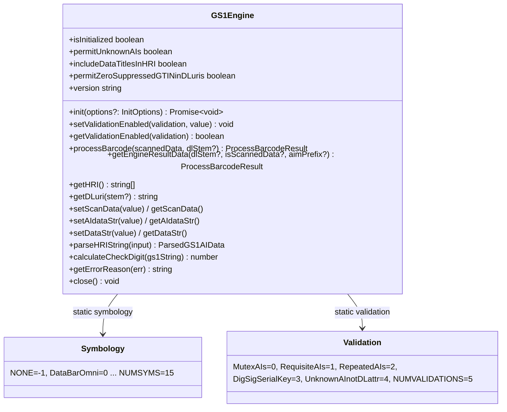
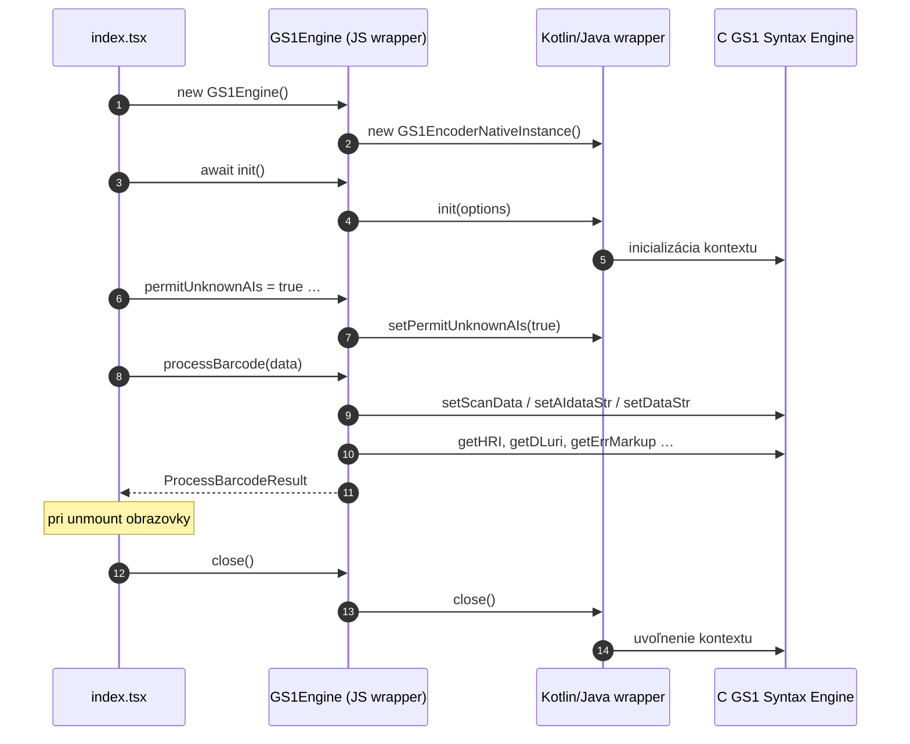

# 5. Knižnica `expo-gs1-syntax-engine`

## 5.1 Čo knižnica je

- Expo native module vytvorený cez `create-expo-module`, obal okolo oficiálnej C knižnice
  [GS1 Barcode Syntax Engine](https://github.com/gs1/gs1-syntax-engine); v použitej verzii
  knižnice je engine **1.4.1**.
- Reťazec závislostí: **C kód** → `.java` wrapper (GS1Encoder.java) → `.kt` + `.ts` wrapper →
  JS API (`GS1Engine`).
- Nie je oficiálny balík GS1 AISBL; poskytuje sa „as-is“.
- Licencia wrapper: MIT; samotný GS1 Syntax Engine: **Apache License 2.0** (pozri `NOTICE`
  v balíku knižnice).
- Použitá verzia v projekte: `^0.1.8` (`package.json`).

## 5.2 API použité v tejto aplikácii

Aplikácia používa iba malú časť API – triedu `GS1Engine`:



| Použité API | Kde v aplikácii |
|---|---|
| `new GS1Engine()` | `initGS1Encoder()` |
| `await init()` | `initGS1Encoder()` |
| `permitUnknownAIs = true` | `initGS1Encoder()` |
| `setValidationEnabled(Validation.RequisiteAIs, true)` | `initGS1Encoder()` |
| `includeDataTitlesInHRI = true` | `initGS1Encoder()` |
| `permitZeroSuppressedGTINinDLuris = false` | `initGS1Encoder()` |
| `processBarcode(data)` | `processScannedData()` |
| `close()` | cleanup `useEffect` |

Nevyužité (ale dostupné) API: `setScanData/getHRI`, `getDLuri`, `getEngineResultData`,
`setAIdataStr`, `setValidationEnabled` pre ostatné validácie, `init(InitOptions)` (slovník
syntax dictionary), `version`.

## 5.3 Vstupné formáty – `processBarcode(scannedData, dlStem?)`

Metóda je „univerzálna“ – sama rozpozná formát podľa úvodných znakov:

| Úvod vstupu | Interpretácia | Interné volanie |
|---|---|---|
| `(` | bracketed AI reťazec, napr. `(01)12345678901231(10)ABC123` | `setAIdataStr()` |
| `]` | scan data s AIM prefixom, napr. `]C101…`, `]d201…` | `setScanData()` (náhrada `{GS}` → `\u001d`) |
| `^` | raw AI syntax (FNC1 ako `^`), napr. `^01123…^10ABC` | `setDataStr()` |
| `http://`, `https://` (obidve veľkosti) | GS1 Digital Link URI | `setDataStr()` |
| číslice (dĺžka 8/12/13/14) | EAN/UPC/GTIN – overí sa **kontrolná číslica**, potom sa zarovná na GTIN-14 (`padStart(14,'0')`) a spracuje ako `^01…`; pri zlej kontrolnej číslici → `success:false, error:'Incorrect numeric check digit'` | `setDataStr()` |
| iné číslice | pokus o dekód ako `^` + reťazec | `setDataStr()` |
| iné (alphanumeric) | pokus o dekód ako `^` + reťazec | `setDataStr()` |

Špecifiká:

- prefix `]E` a `]I` (EAN/UPC, ITF) sa **odstráni** – Syntax Engine nevie spracovať tieto
  symbologie s AIM prefixom; prefix sa uloží do `aimPrefix` vo výsledku.
- `{GS}` sa nahrádza za ASCII 29 (GS separator).
- Ak `dlStem` nie je zadané, použije sa kanonický GS1 stem `https://id.gs1.org`.

## 5.4 Výstup – `ProcessBarcodeResult`

| Pole | Typ | Popis |
|---|---|---|
| `success` | `boolean` | `false`, ak bol detegovaný error markup |
| `error` | `string \| null` | error markup (príčina chyby) |
| `errorReason` | `string \| null` | čitateľná príčina (extrahovaná z verbose správy) |
| `errorMarkup` | `string \| null` | surový error markup (môže obsahovať `\|…\|` označenie chybných znakov) |
| `dataStr` | `string \| null` | raw údaje pripravené na kódovanie |
| `aiDataStr` | `string \| null` | údaje v ľudsky čitateľnej AI syntaxe |
| `hri` | `string[] \| null` | HRI riadky (pri kompozitných kódoch oddelené `--`) |
| `dlUri` | `string \| null` | GS1 Digital Link URI |
| `aiDataPairs` | `AIDataPairs` | `{ AI: { name, value } }` – to, čo aplikácia renderuje |
| `aiOrder` | `string[]` | poradie AI podľa výskytu v kóde |
| `symbology` | `Symbology \| null` | určená symbologia (len ak bol vstup scan data) |
| `symbologyName` | `string \| null` | názov symbologie (napr. `DM`, `GS1_128_CCA`) |
| `scanData` | `string \| null` | rekonštruované scan data |
| `aimPrefix` | `string \| null` | AIM prefix zachytený z vstupu |

### `aiDataPairs` – príklad

```json
{
  "01": { "name": "GTIN",                "value": "08580000000009" },
  "10": { "name": "Lot / Batch Number",  "value": "Lot858" },
  "17": { "name": "Expiration date",     "value": "260716" },
  "21": { "name": "Serial Number",       "value": "Serial01" }
}
```

`aiOrder = ["01","10","17","21"]` – `ScanResultView` podľa neho zoradí riadky (kľúče objektu
sú v JS zoradené numericky, preto je explicitné poradie nutné).

## 5.5 Validácie

| `Validation` enum | Význam | Použité v app |
|---|---|---|
| `MutexAIs` (0) | vzájomne sa vylučujúce AI | nie (default) |
| `RequisiteAIs` (1) | povinné AI musia byť prítomné | **áno** |
| `RepeatedAIs` (2) | opakované AI | nie (default) |
| `DigSigSerialKey` (3) | digitálny podpis / sériový kľúč | nie |
| `UnknownAInotDLattr` (4) | neznáme AI nie ako DL atribút | nie |

Niektoré validácie sú v natívnej knižnici „locked“ (vždy zapnuté).

## 5.6 Životný cyklus engine v aplikácii



## 5.7 Alternatívny prístup (nie je použitý)

Knižnica podporuje aj „pôvodný“ viackrokový prístup:

```ts
encoder.setScanData(']d201085800000000091126071610Lot858\u001D21Serial01');
const hri  = encoder.getHRI();               // string[]
const data = encoder.getEngineResultData();  // ProcessBarcodeResult
```

Táto aplikácia používa výhradne **`processBarcode()`**, ktorý tieto kroky obalí do jedného volania
a navyše doplní `aiDataPairs`, `aiOrder` a `symbologyName`.

## 5.8 Bezpečnosť a limity

- Knižnica je **thread-safe len pri jednej inštancii na vlákno** (gettery mutujú interné buffery).
- `init()` sa dá vykonať raz; opakované volanie varuje (`console.warn`).
- Volania po `close()` vyhodia `IllegalStateException` – preto aplikácia engine drží len počas
  života obrazovky.
- Vstup od používateľa (obsah kódu) sa nikde neposielá na server – všetko je offline.
