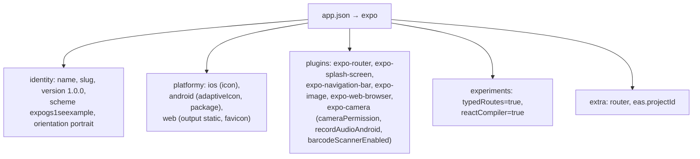
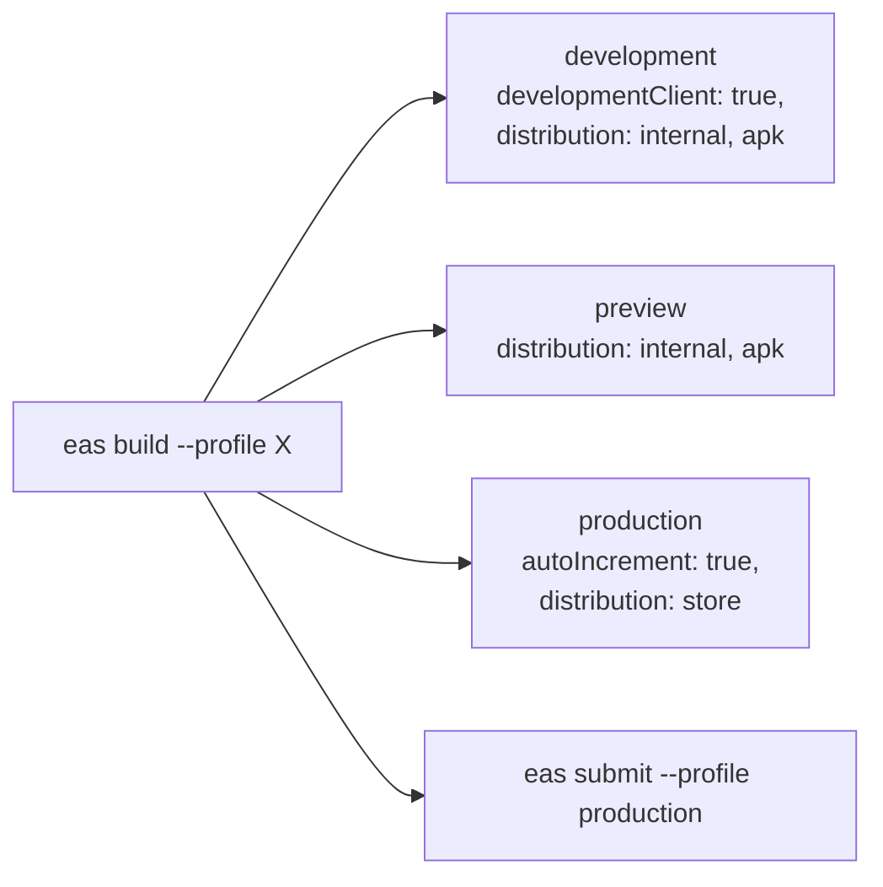
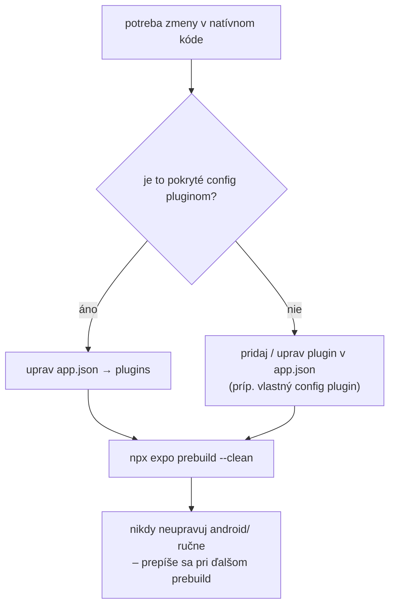

# 6. Konfigurácia a build

## 6.1 Požiadavky na prostredie

| Požiadavka | Poznámka |
|---|---|
| Node.js + `npm` | projekt používa `package-lock.json` |
| Android Studio / Android SDK | pre `npx expo run:android` (a emulátor/zariadenie) |
| JDK 17+ | pre Gradle build |
| `npx expo prebuild` | generuje priečinok `android/` (CNG) |
| Expo CLI | cez `npx` (v `eas.json` je `cli.version: ">= 21.0.2"`) |
| Pre iOS | macOS (priečinok `ios/` zatiaľ nie je vygenerovaný) |

> Aplikácia používa **natívny modul** (`expo-gs1-syntax-engine`) → v Expo Go **nebeží**;
> je potrebný development build (`npx expo run:android` / EAS build).

## 6.2 Inštalácia a spustenie

```bash
# 1) závislosti
npm install

# 2) vygenerovanie natívneho projektu (android/)
npx expo prebuild

# 3) build + spustenie na Androide
npx expo run:android
```

Alternatívne cez npm skripty (`package.json`):

| Skript | Príkaz | Účel |
|---|---|---|
| `npm start` | `expo start` | Metro bundler (dev server) |
| `npm run android` | `expo run:android` | build a spustenie na Android zariadení/emulátore |
| `npm run ios` | `expo run:ios` | build a spustenie na iOS (vyžaduje macOS) |
| `npm run web` | `expo start --web` | webová verzia (bez natívneho engine – obmedzená) |
| `npm run lint` | `expo lint` | lintovanie |
| `npm run reset-project` | `node ./scripts/reset-project.js` | šablóna Expo (reset) |

## 6.3 `app.json` – konfigurácia aplikácie



| Kľúč | Hodnota | Význam |
|---|---|---|
| `name` / `slug` | `expo-gs1-s-e-example` | názov a identifikátor projektu |
| `version` | `1.0.0` | verzia aplikácie |
| `orientation` | `portrait` | zafixovaná orientácia |
| `scheme` | `expogs1seexample` | URL schéma (deep linking) |
| `userInterfaceStyle` | `automatic` | podpora light/dark |
| `icon` | `./assets/images/icon.png` | ikona aplikácie |
| `ios.icon` | `./assets/expo.icon` | iOS ikona |
| `android.package` | `com.expogs1sk.expogs1seexample` | applicationId |
| `android.predictiveBackGestureEnabled` | `false` | vypnutá prediktívna spätná navigácia |
| `android.adaptiveIcon` | foreground/background/monochrome + `backgroundColor #E6F4FE` | adaptívna ikona |
| `web.output` | `static` | statický export webu |
| `experiments.typedRoutes` | `true` | typované trasy expo-router |
| `experiments.reactCompiler` | `true` | React Compiler (memoizácia) |
| `extra.eas.projectId` | `5ea11dac-…` | identifikátor EAS projektu |

### Pluginy

| Plugin | Nastavenie | Efekt |
|---|---|---|
| `expo-router` | – | zapína file-based routing (`main: expo-router/entry`) |
| `expo-splash-screen` | `backgroundColor #208AEF`, `image ./assets/images/splash-icon.png`, `imageWidth 76` | splash obrazovka |
| `expo-navigation-bar` | `enforceContrast true`, `hidden false`, `style dark` | Android navigačná lišta (tmavý štýl, kontrast vynútený) |
| `expo-image` | – | konfigurácia obrázkov |
| `expo-web-browser` | – | `Linking`/webový prehliadač |
| `expo-camera` | `cameraPermission "Allow $(PRODUCT_NAME) to access your camera"`, `recordAudioAndroid false`, `barcodeScannerEnabled true` | iOS `NSCameraUsageDescription` (text žiadosti o kameru); na Androide sa **nepridá** `RECORD_AUDIO`; barcode scanner ponechaný zapnutý (default `true`) |

> `recordAudioAndroid: false` znamená, že `android.permission.RECORD_AUDIO` **nebude** v manifeste
> po ďalšom `npx expo prebuild` – v použitej verzii `expo-camera` už toto povolenie nepridáva
> modul sám, ale výhradne config plugin (CHANGELOG `expo-camera`: *„Remove `RECORD_AUDIO` from the
> manifest so `recordAudioAndroid` depends on the plugin“*). `barcodeScannerEnabled` je defaultne
> `true` → gradle property `expo.camera.barcode-scanner-enabled` sa nastavuje len pri hodnote `false`.

`<NavigationBar style="dark" />` sa navyše volá priamo v `index.tsx` (runtime zmena štýlu).

## 6.4 `package.json` – závislosti

| Skupina | Balíky |
|---|---|
| **Kľúčové** | `expo ^57.0.16`, `react 19.2.3`, `react-native 0.86.2`, `expo-router ~57.0.16`, `expo-camera ~57.0.4`, **`expo-gs1-syntax-engine ^0.1.8`** |
| UI / ikony | `@react-native-vector-icons/ant-design ^13.1.2`, `@expo/ui ~57.0.13`, `expo-symbols`, `expo-image`, `expo-font`, `@expo-google-fonts/material-symbols` (transitívne) |
| Navigácia / gestá | `react-native-screens`, `react-native-safe-area-context`, `react-native-gesture-handler`, `react-native-reanimated 4.5.1`, `react-native-worklets` |
| Expo utilitky | `expo-constants`, `expo-device`, `expo-linking`, `expo-navigation-bar`, `expo-splash-screen`, `expo-status-bar`, `expo-system-ui`, `expo-web-browser`, `expo-glass-effect` |
| Web | `react-dom`, `react-native-web ~0.21.0`, `metro ^0.84.4` |
| Dev | `typescript ~6.0.3`, `@types/react ~19.2.2` |

`overrides` prepisujú problematické tranzitívne závislosti (`function-bind`, `hasown`,
`is-core-module`, `object-assign`, `path-parse`, `postcss/nanoid`, `safe-buffer`, `shell-quote`,
`uuid`) – ide o workaroundy na známe audit/CVE problémy.

## 6.5 `tsconfig.json`

```json
{
  "extends": "expo/tsconfig.base",
  "compilerOptions": {
    "strict": true,
    "paths": { "@/*": ["./src/*"], "@/assets/*": ["./assets/*"] }
  },
  "include": ["**/*.ts", "**/*.tsx", ".expo/types/**/*.ts", "expo-env.d.ts"]
}
```

- **strict** – plný strict režim.
- **aliasy** – `@/...` (projekt) a `@/assets/...` (asset).
- `expo-env.d.ts` – typy generované Expo (napr. typované trasy).

## 6.6 `eas.json` – EAS Build profily



| Profil | `developmentClient` | `distribution` | Android `buildType` | `autoIncrement` | Účel |
|---|---|---|---|---|---|
| `development` | `true` | `internal` | `apk` | – | dev client pre ladenie |
| `preview` | – | `internal` | `apk` | – | interná distribúcia (apk na test) |
| `production` | – | `store` | – | `true` | build pre obchod (AAB) |

Ostatné: `cli.version >= 21.0.2`, `cli.appVersionSource = "remote"`, `submit.production = {}`.

Príklady príkazov:

```bash
eas build --platform android --profile preview
eas build --platform android --profile production
eas submit --platform android --profile production
```

## 6.7 Android natívna konfigurácia (`android/`, generované)

`android/app/src/main/AndroidManifest.xml` – dôležité prvky:

| Prvok | Hodnota | Dôvod |
|---|---|---|
| `uses-permission CAMERA` | – | pridáva `expo-camera` (nutné pre skener) |
| `uses-permission INTERNET` | – | Metro/dev a web |
| `uses-permission RECORD_AUDIO` | – | **už sa nepridáva** – plugin `expo-camera` má `recordAudioAndroid: false` (ešte pred zmenou `app.json` ho `expo-camera` pridával) |
| `uses-permission VIBRATE`, `SYSTEM_ALERT_WINDOW`, `READ/WRITE_EXTERNAL_STORAGE` (maxSdk 32) | – | štandardné Expo povolenia |
| `intent-filter` VIEW + schéma `expogs1seexample` | – | deep linking |
| `screenOrientation` | `portrait` | zodpovedá `app.json` |
| `expo.modules.updates.ENABLED` | `false` | Expo Updates vypnuté |
| `enableOnBackInvokedCallback` | `false` | prediktívny back gesture vypnutý |

> **Poznámka k aktuálnosti:** vygenerovaný `android/` v repozitári ešte pochádza z predošlého
> prebuildu (obsahuje `RECORD_AUDIO`); po zmene `app.json` (plugin `expo-camera`) je potrebné
> `npx expo prebuild --clean`, aby sa prejavilo `recordAudioAndroid: false`.

## 6.8 Postup zmeny natívnej konfigurácie



## 6.9 Overenie inštalácie / typical troubleshooting

| Problém | Riešenie |
|---|---|
| `Invalid hook call` / chyba natívneho modulu | spustiť `npm install` a znova `npx expo prebuild` |
| „GS1 Syntax Engine instance has not been initialized“ | engine sa ešte inicializuje alebo `init()` zlyhal – skontrolovať `errorText` |
| Skener sa nespúšťa | overiť oprávnenie kamery a `isModernBarcodeScannerAvailable` (Google Code Scanner vyžaduje zariadenie s GMS) |
| „Camera is not enabled“ | zapnúť kamera oprávnenia a **reštartovať aplikáciu** (text v UI) |
| Zmena `app.json` sa neprejaví | `npx expo prebuild --clean` |
| Chyba v `overrides` závislostiach | aktualizovať `package-lock.json` (`npm install`) |
