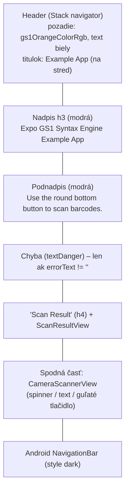

# 7. Dizajn a štýly

## 7.1 Farebná paleta – `src/styles/Colors.tsx`

| Kľúč | Hodnota | Použitie |
|---|---|---|
| `gs1BlueColorRgb` | `rgb(0,44,108)` | primárna textová farba (nadpisy, popisky, spinner) |
| `gs1BlueColorRgb05op` | `rgba(0,44,108,0.5)` | modrá s priehľadnosťou |
| `gs1OrangeColorRgb` | `rgb(242, 99, 52)` | GS1 brand oranžová – hlavička, tlačidlá, zvýraznenia |
| `gs1OrangeColorRgba09/07/03/01` | `rgba(242,99,52, 0.9/0.7/0.3/0.1)` | orámovania, pozadia |
| `greyedTabRgb` | `rgb(55,55,55)` | bežný text |
| `dangerColor` (+05op) | `rgb(220,53,69)` | chybové hlášky (`textDanger`) |
| `successColor` (+02) | `rgb(25,135,84)` | úspech (`textSuccess`, `backgroundSuccess02`) |
| `warningColor` (+05op) | `rgb(255,193,7)` | varovania (`textWarning` – chyba dekódovania) |

> Farebnosť kopíruje GS1 brand (modrá `#002C6C` + oranžová `#F26334`) a splash screen
> (`#208AEF`) a adaptive icon background (`#E6F4FE`) sú v `app.json`.

## 7.2 Utility štýly – `src/styles/styles.tsx`

Štýly sú definované cez `StyleSheet.create` a používajú sa v tvare Bootstrapu –
`styles.h3`, `styles.py2`, … (skladanie do poľa `style={[...]}`).

### Skupina: rozloženie (layout)

| Trieda | Význam |
|---|---|
| `containerBase` | `flex:1`, biely podklad – základný kontajner |
| `containerMain` | `flex:1`, stretch, biely podklad |
| `containerCenterAll` | `flex:1`, centrované vodorovne aj zvisle |
| `containerCenterHorizontally` | centrované vodorovne |
| `containerAbsoluteBR` | absolútne umiestnenie vpravo dole |
| `containerRounded` | `borderRadius: 50` |
| `flex1`, `flexGrow1`, `alignSelfEnd`, `centerHorizontally` | pomocné flex utility |

### Skupina: medzery (Bootstrap-like mierky 1–5 → 6/12/18/28/40 px)

| Predpona | Význam | Hodnoty |
|---|---|---|
| `m*` | margin | `mb1..mb5`, `mt1..mt4`, `me1..me3`, `mx1..mx2`, `my1..my3` |
| `p*` | padding | `pb1..pb5`, `pt1..pt5`, `ps1..ps2`, `pe1..pe4`, `px1..px4`, `py1..py4` |

Mierky: `1 = 6px`, `2 = 12px`, `3 = 18px`, `4 = 28px`, `5 = 40px`.

### Skupina: text a farby

| Trieda | Význam |
|---|---|
| `h1, h2, h3, h4` | nadpisy (22/20/18/16 px, GS1 modrá, bold, s vertikálnymi medzerami) |
| `textCenter`, `textJustify`, `textWrap` | zarovnanie / zalamovanie |
| `text`, `textNormal` | bežný text `greyedTabRgb`, 14 px |
| `textGs1Blue`, `textGs1Orange`, `textGs1Theme` | GS1 modrá / oranžová |
| `textDanger`, `textWarning`, `textSuccess`, `textWhite` | stavové farby |
| `fontWeightBold`, `fontSize11/16/18/20/22` | tučné písmo / veľkosti |
| `selectedText` | oranžové + bold (výber) |

### Skupina: tlačidlá a orámovanie

| Trieda | Význam |
|---|---|
| `btnNotPressed` | biele pozadie, oranžový border a text |
| `btnPressed` | oranžové pozadie, biely border a text |
| `roundedBorderBtn` | `borderWidth:2`, `borderRadius:50`, `alignSelf:flex-end` |
| `bottomRoundButton` | zaoblené spodné tlačidlo (rezerva) |
| `borderBottom` | spodná orámovacia linka (oranžová, 2 px) |
| `backgroundWhite`, `backgroundOrange09`, `backgroundSuccess02` | pozadia |

## 7.3 Typografia

| Úroveň | Veľkosť | Farba | Štýl | Použitie v UI |
|---|---|---|---|---|
| `h2` | 20 | GS1 modrá | bold | `ActivityIndicatorCentered.heading` |
| `h3` | 18 | GS1 modrá | bold | nadpis *Expo GS1 Syntax Engine Example App* |
| `h4` | 16 | GS1 modrá | bold | nadpis *Scan Result* |
| bežný | 14 | `greyedTabRgb` / modrá | regular | podnadpis, popisky AI |

Ikony: `@react-native-vector-icons/ant-design/static` (váha „static“), používa sa ikona `scan`
veľkosti 30.

## 7.4 Vizuálna štruktúra obrazovky

## 7.5 Pravidlá používania štýlov

- Štýly sa **nekascadujú** – pri zmene treba upraviť `styles.tsx` (zdieľané pre celú app).
- Komponenty skladajú štýly ako pole: `style={[styles.textCenter, styles.pb3, styles.textDanger]}`.
- Position: absolútne umiestnenie tlačidla sa robí cez `containerAbsoluteBR`
  (koreňom je `View` s `containerBase`).
- Konzistencia: všetky farby idú cez `Colors.tsx` – nevkladať hex literály priamo do komponentov
  (okrem lokálnych `'#fff'`).

## 7.6 Responzivita a prístupnosť

| Téma | Stav v kóde |
|---|---|
| Orientácia | portrait (zafixovaná v `app.json` a Manifeste) |
| Safe area | `SafeAreaView` s `edges={['bottom','left','right']}` (hlavička riešená navigatorom) |
| Kontrast navigačnej lišty | plugin `expo-navigation-bar` s `enforceContrast: true` |
| Dark mode | `userInterfaceStyle: automatic`, ale štýly sú pevné (biele pozadie `containerBase`) |
| Veľkosť dotykových cieľov | guľaté tlačidlo má padding `px3 py3` (18 px) + border 2 px |
| Popisky pre čítače obrazovky | – (neimplementované) |
| Lokalizácia | – (texty sú pevné, anglické) |
