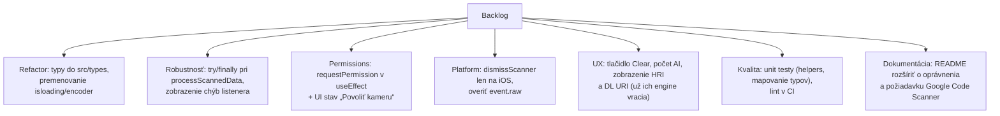

# 8. Obmedzenia, známe problémy a ďalší vývoj

## 8.1 Funkčné obmedzenia (očakávané pri demo app)

| # | Obmedzenie | Popis |
|---|---|---|
| 1 | Iba jedna obrazovka | žiadna história skenov, nastavenia, export |
| 2 | Iba Android overené | `README.md` uvádza len `npx expo run:android`; iOS priečinok nie je vygenerovaný |
| 3 | Iba offline | výsledky sa nikam neodosielajú |
| 4 | Jazyk | pevné anglické texty, bez i18n |
| 5 | Dark mode | `userInterfaceStyle: automatic`, ale štýly sú fixné (biele pozadie) |
| 6 | Bez testov | v repozitári nie sú unit/e2e testy ani `jest` konfigurácia |
| 7 | Bez CI | nie je prítomná GitHub Actions/workflow konfigurácia |
| 8 | Expo Updates vypnuté | `expo.modules.updates.ENABLED = false` – žiadne OTA aktualizácie |
| 9 | Posledný výsledok sa nikdy nečistí | po úspešnom skene zostáva na obrazovke (nie je „Clear“) |
| 10 | Web nie je plnohodnotný | `expo-gs1-syntax-engine` má web fallback (`ExpoGs1SyntaxEngineModule.web.ts`), no skener `launchScanner` je Android/iOS only |

## 8.2 Známe problémy / technický dlh

> Kód nebol menený touto dokumentáciou; nasleduje analytický prehľad pozorovaní v zdrojovom kóde.

| # | Lokalita | Problém | Dopad | Odporúčanie |
|---|---|---|---|---|
| P1 | `cameraScanner.tsx` (render) | `requestPermission()` sa volá **priamo počas renderu**, ak oprávnenie nie je udelené | môže spôsobiť opakované re-render/volania (React strict mode) | presunúť do `useEffect` alebo zobraziť tlačidlo „Povoliť kameru“ |
| P2 | `cameraScanner.tsx` (listener) | `CameraView.dismissScanner()` je podľa dokumentácie Expo SDK 57 **iOS-only**; na Androide sa skener zatvorí automaticky | volanie na Androide je nadbytočné; ak by hodilo výnimku, *vnútri callbacku* ju nič nezachytí (try/after-the-fact blok obalí len registráciu listenera) | podmieniť platformou (`Platform.OS === 'ios'`) a pridať vlastný try/catch v callbacku |
| P3 | `cameraScanner.tsx` | `event.raw` **nie je dokumentované** v type `ScanningResult` (docs SDK 57 uvádzajú len `data` a `type`); kód používa `event.raw?.…` | ak `raw` chýba, GS1 detekcia (`startsWithFnc1`) je `undefined`/false → kód nebude označený ako GS1 | overiť dostupnosť `raw` v použitej verzii `expo-camera`; mať fallback na `data.charCodeAt(0) === 29` |
| P4 | `cameraScanner.tsx` (`catch`) | pri chybe registrácie listenera sa nastaví `timestamp: 0` | efekt v `index.tsx` podmieňuje `lastCameraScan.timestamp` truthiness → sken sa **nespracuje**, chyba sa nikde nezobrazí | nastaviť reálny timestamp a zobraziť `errorText` |
| P5 | `index.tsx` (`processScannedData`) | vetva `if (!encoder)` vráti funkciu **skôr**, než sa stihne `setIsProcessingData(false)`; rovnako chýba `try/finally` okolo `processBarcode()` | pri neinicializovanom engine (chyba init) zostane UI navždy v stave „Processing scan data“ | presunúť `setIsProcessingData(false)` do `finally`, resp. nastaviť ho aj vo vetve chyby |
| P6 | `index.tsx` | `doCameraTests()` sa viaže na `cameraRef` **skrytého** `CameraView`, ktorý sa odmontuje po `isInitialized=true` | ak by sa test mal opakovať (napr. po zmene oprávnení), ref už nie je dostupný | nechať ref počas života obrazovky alebo presunúť test inam |
| P7 | `index.tsx` vs `scanResultView.tsx` | `barcodeScanResult` je definovaný v `index.tsx` a importovaný späť z view → kruhová závislosť | mätúce, horšia testovateľnosť | presunúť do `src/types/types.tsx` |
| P8 | `index.tsx` | premenovanie `isloading` (preklep) a premenná `encoder`, ktorá drží **dekódovací** engine | čitateľnosť | premenovať na `isLoading` / `decoder` |
| P9 | `cameraScannerView.tsx` | `ViewFixedText()` je funkcia volaná ako `ViewFixedText('text')`, nie komponent | funguje, ale je to neštandardné (pri komponente by sa volalo `<ViewFixedText …/>`) | ponechať ako čistú helper funkciu alebo spraviť komponent s `props.text` |
| P10 | `helpers.ts` | `calculateCheckDigit()` je **nevyužitý** duplikát metódy `GS1Engine.calculateCheckDigit()` | mŕtvy kód | odstrániť alebo delegovať na knižnicu |
| P11 | `helpers.ts` | `getDateTimeMilisecs()` nepoužíva `padStart`, sekundy/ms sa nezapisujú na 2/3 číslice | nejednotný formát času (`06.10.2026 9:5:3:7`) | použiť `padStart(2,'0')` / `padStart(3,'0')` alebo `Intl.DateTimeFormat` |
| P12 | `scanResultView.tsx` | `FlatList` (zoznam AI) je vnorený vo flex kontajneri v rámci jednej obrazovky bez samostatného scroll kontajnera | pri veľkom počte AI môže byť zoznam orezaný namiesto scrollu; zároveň sa ťažko kombinuje so scrollovaním celej stránky | použiť `map()` + scrollovať celú obrazovku, alebo spraviť z hlavnej obrazovky `FlatList` |
| P13 | `index.tsx` | deduplikácia skenov cez `Date.now()` – dva skeny v tej istej ms by sa zlúčili | teoretická strata skenu | použiť unikátne id (napr. counter) |
| P14 | `cameraScanner.tsx` | mapa typov kódov končí na `-1`/`0` (unknown) – chýbajú napr. RM (DataBar) kľúče | neznáme symbologie sa zobrazia ako „unknown“ | doplniť podľa ML Kit `Barcode.FORMAT_*` |
| P15 | `README.md` vs kód | README uvádza „single Stack screen“ a „bottom round button“, ale nezmieňuje oprávnenia ani požiadavku GMS (Google Code Scanner) | nováčik môže naraziť na zariadeniach bez Google služieb | doplniť do README |

## 8.3 Platformové špecifiká

| Funkcia | Android | iOS |
|---|---|---|
| `CameraView.launchScanner()` | Google Code Scanner (vyžaduje GMS) | `DataScannerViewController` (iOS 16+) |
| `CameraView.dismissScanner()` | automatické po načítaní kódu (volanie je nadbytočné) | **vyžadované** na zatvorenie modalu |
| `ScanningOptions` (barcodeTypes atď.) | podľa dokumentácie nie je použiteľné | áno (filtrácia typov kódov) |
| `getSupportedFeatures()` | áno | áno |
| `screenOrientation` portrait | zafixované v Manifeste | z `app.json` |
| Navigačná lišta | `expo-navigation-bar` (`style: dark`) | – |
| Hĺbka/spätná navigácia | `predictiveBackGestureEnabled: false` | – |

## 8.4 Bezpečnosť a súkromie

- Aplikácia **neodosiela žiadne údaje** na server; dekódovanie prebieha lokálne v natívnom C engine.
- Oprávnenia: `CAMERA` (nevyhnutné), plus štandardné Expo povolenia pridané do Manifestu
  (`INTERNET`, `RECORD_AUDIO`, `VIBRATE`, `READ/WRITE_EXTERNAL_STORAGE` ≤ SDK 32,
  `SYSTEM_ALERT_WINDOW`).
- Odporúčanie: pre produkčnú aplikáciu prehodnotiť nutnosť `RECORD_AUDIO` a `SYSTEM_ALERT_WINDOW`
  (minimalizácia oprávnení) – pridávajú sa konfiguráciou `expo-camera` resp. `app.json → android.permissions`.
- Obsah kódu pochádza z dôveryhodného zdroja (používateľ), no `processBarcode` spracováva
  ľubovoľný reťazec – engine je na to navrhnutý (validácia vstupu na strane C knižnice).

## 8.5 Changelog a plán (podľa repozitára)

`changelog.md`:

| Verzia | Zmeny |
|---|---|
| `vxxx` (pracovná) | Pridaná `NavigationBar`, predvolená téma „dark“ |
| `v1.0.0` | initial commit |

`ToDo.md` – obsahuje len nadpis `# ToDo` (zoznam úloh je zatiaľ prázdny).

### Návrh backlogu (odvodený z analýzy)

## 8.6 Nevyužitý potenciál knižnice

Engine už vracia dáta, ktoré aplikácia nezobrazuje – vhodné rozšírenia UI:

| Pole výsledku | Možné zobrazenie |
|---|---|
| `hri` | čitateľný HRI riadok (vrátane oddeľovača `--` pri kompozitných kódoch) |
| `dlUri` | klikateľná GS1 Digital Link URI (`expo-web-browser` je už v závislostiach) |
| `dataStr` / `aiDataStr` | surové vs. bracketed údaje (napr. pre zdieľanie) |
| `symbologyName` | automatické určenie symbologie namiesto odhadu „(est.)“ |
| `errorMarkup` | zvýraznenie chybných znakov v údajoch |
| `aimPrefix` | zobraziť AIM prefix samostatne |
